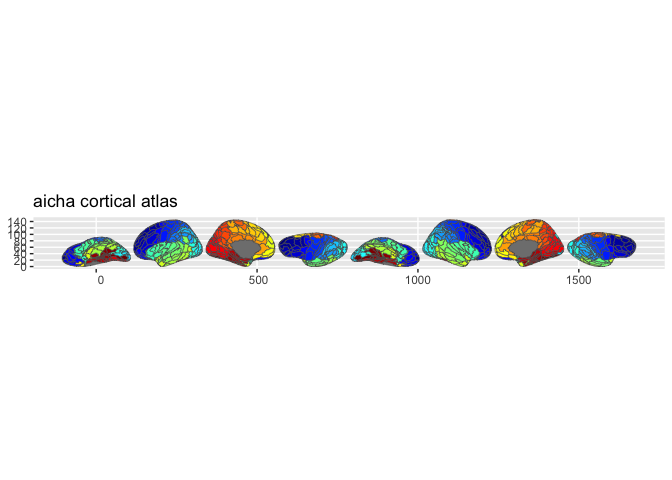

# ggsegAicha

AICHA Atlas for the ggsegverse Ecosystem.

## Installation

``` r
# From r-universe
install.packages("ggsegAicha", repos = "https://ggsegverse.r-universe.dev")

# From GitHub
# install.packages("remotes")
remotes::install_github("ggsegverse/ggsegAicha")
```

## Atlases

### aicha

Atlas of Intrinsic Connectivity of Homotopic Areas.

``` r
library(ggsegAicha)
plot(aicha())
```

 \## Data source

Annotation files on fsaverage5.

- **Reference**: Joliot et al. (2015)
  [doi:10.1016/j.jneumeth.2015.07.013](https://doi.org/10.1016/j.jneumeth.2015.07.013)

- **Date obtained**: 2021-10-15
