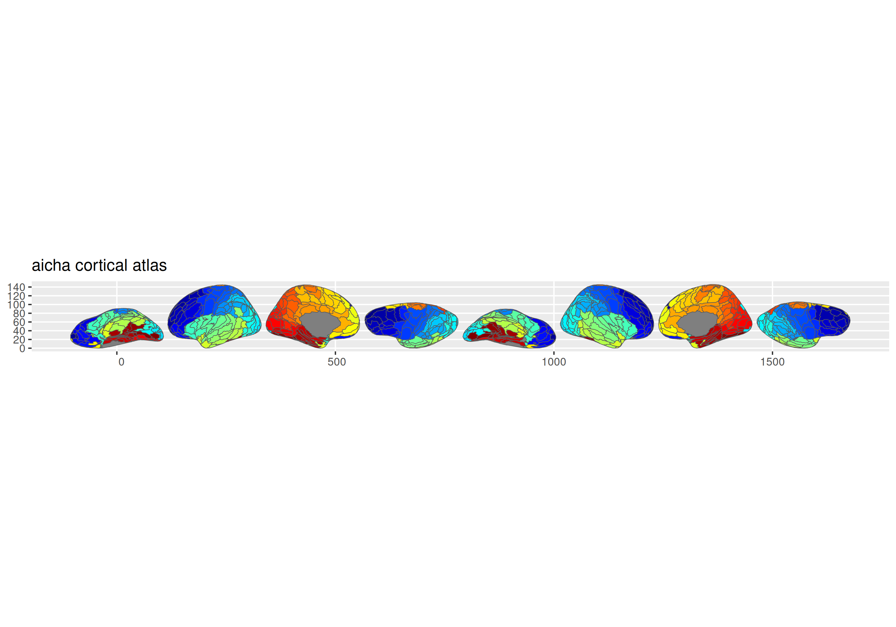
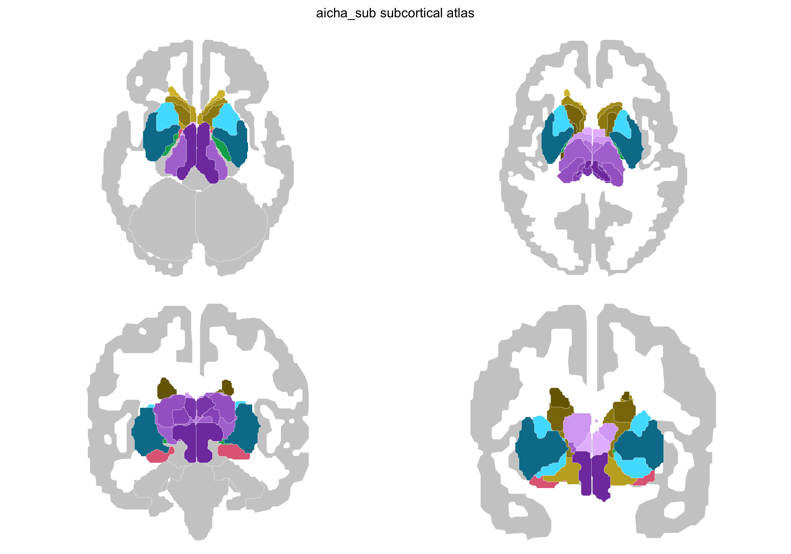

# ggsegAicha

This package contains datasets for plotting the AICHA atlas for ggseg:
the cortical parcellation
([`aicha()`](https://ggseg.github.io/ggsegAicha/reference/aicha.md), 342
regions) and the subcortical one
([`aicha_sub()`](https://ggseg.github.io/ggsegAicha/reference/aicha_sub.md),
20 parcels per hemisphere).

Joliot M, Jobard G, Naveau M, Delcroix N, Petit L, Zago L, … &
Tzourio-Mazoyer N (2015). AICHA: An atlas of intrinsic connectivity of
homotopic areas. *Journal of Neuroscience Methods*, 254, 46-59.

## Installation

We recommend installing the ggseg-atlases through the ggseg
[r-universe](https://ggseg.r-universe.dev/ui#builds):

``` r

options(repos = c(
  ggseg = "https://ggseg.r-universe.dev",
  CRAN = "https://cloud.r-project.org"
))

install.packages("ggsegAicha")
```

You can install this package from [GitHub](https://github.com/) with:

``` r

# install.packages("pak")
pak::pak("ggsegverse/ggsegAicha")
```

## AICHA atlas

``` r

library(ggseg)
library(ggsegAicha)

plot(aicha())
```



## AICHA subcortical atlas

``` r

plot(aicha_sub())
```



## Data source

Joliot M, Jobard G, Naveau M, Delcroix N, Petit L, Zago L, … &
Tzourio-Mazoyer N (2015). AICHA: An atlas of intrinsic connectivity of
homotopic areas. *Journal of Neuroscience Methods*, 254, 46-59.
